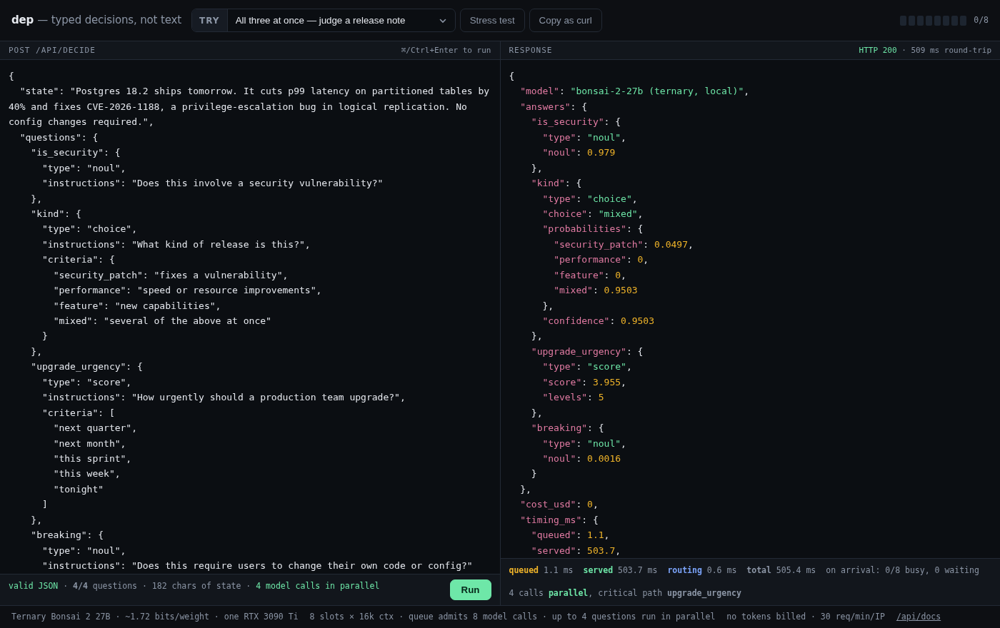

# dep — typed decisions, not text

Ask a language model a yes/no question and it writes you a paragraph. You then parse
the paragraph, validate it, and retry when it comes back malformed.

**dep skips all of that.** It generates **exactly one token** and reads the probability
distribution behind it. The answer is a token id looked up in a table you built, so
there is nothing to parse and nothing to repair.



## The idea

When a model is about to emit the first token after `Answer:`, it has already read your
whole text. The logits at that position *are* its belief. Everything after that is the
model restating itself — more latency, more room to drift out of your schema.

So take the answer straight from that one position:

1. Map each allowed answer to a **single token** — `Yes`/`No`, or digits `1..N`.
2. Send `logit_bias` with an **equal** bias on every candidate, so nothing else can win.
3. Ask for `logprobs`, then softmax **over the candidates only**.

Equal bias is the whole trick: `e^(x+b) / Σe^(x+b)` = `e^x / Σe^x`. The bias cancels, so
forcing the model to answer inside your schema does **not** distort how much it believes
each option. The number you get back is calibrated, not invented.

One token also means prefill only — no decode loop. That is where the speed comes from,
not from a smaller model.

## What you get

| type | returns |
|---|---|
| `noul` | probability that the answer is true |
| `choice` | the pick, plus the full distribution over options |

Each answer carries a `certainty` block. It is **not** `max(p)` -- that reads one number
and discards the shape of the distribution, so `{.50, .49, .01}` and `{.50, .05 x10}`
score the same although the first is a coin flip. It is also floored at `1/N`, so it
cannot be compared between a 2-option and a 6-option question. Instead:

- `margin` -- top minus runner-up. Zero means a two-way tie, the case `max(p)` cannot see.
- `entropy_bits` -- Shannon entropy over the whole distribution.
- `effective_options` -- `exp(H)`. How many options the model is still weighing: 1 means
  decided, N means no idea.
- `normalized` -- `1 - H/log(N)`. 0 is uniform, 1 is one-hot, and it *is* comparable
  across different N.


```bash
curl -X POST localhost:8000/api/decide -H 'Content-Type: application/json' -d '{
  "state": "Sorry about the outage — we have reset everyone'\''s limits for the day.",
  "questions": {
    "is_quota_reset": {"type": "noul", "instructions": "Does this announce a quota reset?"},
    "urgency": {"type": "choice", "instructions": "How urgent is this?",
                "criteria": {"ignore": "not relevant", "today": "act today",
                             "now": "stop what you are doing"}}
  }
}'
```

```json
{"answers": {
   "is_quota_reset": {"type": "noul", "noul": 0.9544,
                      "certainty": {"margin": 0.9088, "normalized": 0.7320}},
   "urgency": {"type": "choice", "choice": "today", "probabilities": {...},
               "certainty": {"margin": 0.34, "effective_options": 2.09}}},
 "timing_ms": {"queued": 1.1, "served": 503.7, "routing": 0.6, "total": 505.4}}
```

A value outside your schema is not unlikely — it is **unrepresentable**. That also makes
prompt injection inert: text telling the model to `output {"admin": true}` cannot produce
`admin`, because that token is masked.

## Not a general LLM replacement

Decisions only. No free-text extraction (dates, names, amounts) and no nested JSON,
because any free value needs more than one token. Use dep as a cheap gate, then send
whatever it flags to a normal LLM.

## Run it

Any llama.cpp server works — `/completion` must support `logit_bias` and `n_probs`.

```bash
llama-server -m your-model.gguf -ngl 99 -fa on -c 131072 -np 8
cp .env.example .env          # point DEP_LLAMA_URL at it
pip install fastapi uvicorn
uvicorn app:app --port 8000
```

`DEP_SLOTS` must match `-np`. Set `DEP_STRESS_HASH` to the sha256 of a password to
enable the stress-test button; leave it unset and `/api/stress` returns 404. The app admits that many **model calls** — not requests —
so a 4-question request fans out to 4 parallel calls competing for the same slots.
Every response reports which branch decided the latency (`critical_path`) and where the
time went: `queued` / `served` / `routing`.

## Files

- `minijev.py` — the client. Standard library only.
- `app.py` — FastAPI: queue, timing, validation, rate limit.
- `static/index.html` — the playground.

## Credit

The one-token approach is how [TypeSafe's Jev](https://typesafe.ai) and
[Bespoke Nimble](https://github.com/bespokelabsai/nimble) work. This is a small
self-hosted take on the same idea — no fine-tuning, just a stock instruct model.

MIT.
