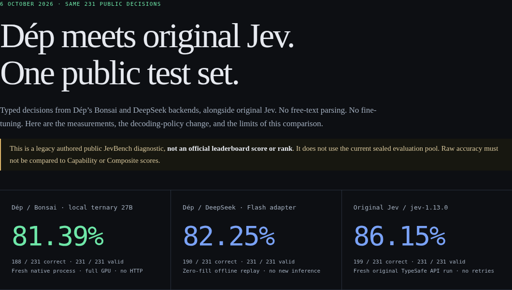

# Dép — decisions, not paragraphs

A small experiment in **Jev-like typed decisions** using existing language models.
No fine-tuning: text and a fixed rubric go in; a choice, yes/no probability, or
ordinal score comes out.

[Try Dép](https://dep.hungson175.com) · [Benchmark report](https://hungson175.github.io/dep/)

## The principle

Instead of asking a model to write an answer and then parsing it, Dép reads the
probabilities at the **first answer-token position**:

1. Give each allowed answer a single-token marker.
2. Supply the state, instructions, and rubric in the prompt.
3. Read the candidate logits or token log-probabilities and normalize over the
   allowed answers.
4. Return the selected label and its distribution; for ordered levels, return
   the probability-weighted score.

The **Bonsai backend** uses an equal candidate bias: adding the same constant to
all candidate logits leaves their relative softmax probabilities unchanged.
Our native benchmark reads the first-answer logits without a decode loop.
The **DeepSeek adapter** reads the API’s first-token log-probabilities instead,
without logit bias. Missing options default to zero and the available mass is
renormalized—an approximation, not proof of zero probability.

**This is our hypothesis-driven replication of Jev-like behavior, not a claim
about original Jev’s internals. We do not know how its private model works.**
Model probabilities are not automatically calibrated, and a bounded output
schema does not make the decision correct or immune to prompt injection.

## What the benchmark says

Same **231 legacy public cases**: original Jev **86.15%**, Dép / DeepSeek **82.25%**,
Dép / Bonsai **81.39%**. This is not an official leaderboard score or rank.
Bonsai latency is measured natively; hosted API timings include the network and
are not directly comparable. DeepSeek’s zero-fill result replays saved responses.

[Full HTML report, timing boundaries, methodology, and evidence](https://hungson175.github.io/dep/)

## Use or explore

- [DeepSeek Python library: installation and examples](docs/dep_deepseek.md)
- [Original experiment and API](minijev.py) · [Learning notebooks](learn/)
- [Service setup and safeguards](docs/site_deployment.md)

MIT. Inspired by the typed-decision idea; no claim of access to Jev’s architecture.
