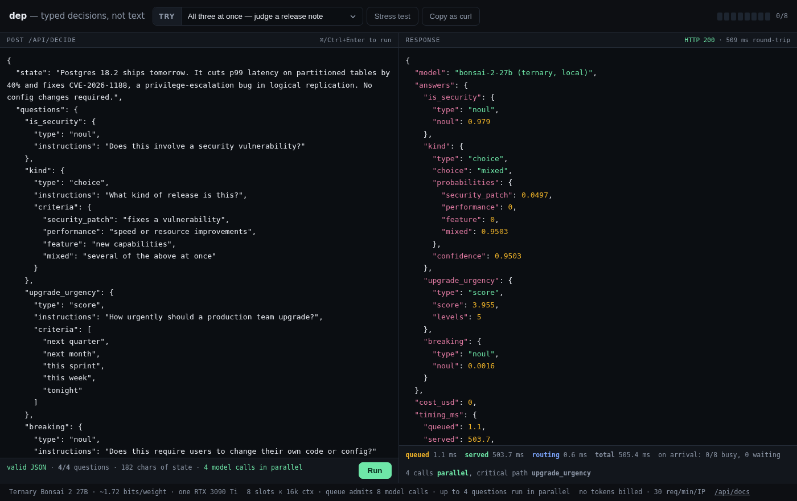

# dep — typed decisions, not text

Ask a language model a yes/no question and it writes you a paragraph. You then parse
the paragraph, validate it, and retry when it comes back malformed.

**dep skips all of that.** It generates **exactly one token** and reads the probability
distribution behind it. The answer is a token id looked up in a table you built, so
there is nothing to parse and nothing to repair.



## DeepSeek: install and use in minutes

No GPU, llama.cpp, web server, or runtime dependencies. Requires Python 3.10+.

```bash
python -m pip install https://github.com/hungson175/dep/releases/download/dep-deepseek-v0.1.0/dep_deepseek-0.1.0-py3-none-any.whl
```

Set your own `DEEPSEEK_API_KEY` securely in your environment, then:

```python
from dep_deepseek import DeepSeek

dep = DeepSeek()
answer = dep.choice("Please cancel my order.", "Customer intent?",
                    ["cancel", "track", "other"])
print(answer["choice"])
print(answer["probabilities"])
```

Also supports `dep.noul(...)`, `dep.score(...)`, and `dep.predict(...)` for typed
batches. Missing options return 0.0, with a complete normalized map. This is an
approximation of an incomplete probability window, not a calibrated guarantee.
The adapter makes paid requests using **your** key; no automatic retries or
built-in spending cap. It never reads `.env` files. Hosted inference adapter,
not a fine-tuned model. [Full API and examples](docs/dep_deepseek.md) ·
[GitHub release](https://github.com/hungson175/dep/releases/tag/dep-deepseek-v0.1.0).
Distributed on GitHub, **not PyPI**.

## The idea

When a model is about to emit the first token after `Answer:`, it has already read your
whole text. The logits at that position *are* its belief. Everything after that is the
model restating itself — more latency, more room to drift out of your schema.

So take the answer straight from that one position:

1. Map each allowed answer to a **single token** — `Yes`/`No`, or digits `1..N`.
2. Send `logit_bias` with an **equal** bias on every candidate, so nothing else can win.
3. Ask for `logprobs`, then softmax **over the candidates only**.

Equal bias is the whole trick: `e^(x+b) / Σe^(x+b)` = `e^x / Σe^x`. The bias cancels, so
forcing the model to answer inside your schema does **not** distort how much it believes
each option. The number you get back is calibrated, not invented.

One token also means prefill only — no decode loop. That is where the speed comes from,
not from a smaller model.

## What you get

| type | returns |
|---|---|
| `noul` | probability that the answer is true |
| `choice` | the pick, plus the full distribution over options |
| `score` | probability-weighted value over an ordered rubric |

Every answer carries one `confidence` number: **the top probability minus the
runner-up**.

Not `max(p)`. That is floored at `1/N`, so 0.50 means "coin flip" with two options and
"fairly sure" with six, and it cannot tell `{.50, .49}` from `{.50, .05 x10}` — the first
is a tie, the second is a clear call. The margin is 0 for a dead tie and 1 for certainty,
whatever N is.

```bash
curl -X POST localhost:8000/api/decide -H 'Content-Type: application/json' -d '{
  "state": "Sorry about the outage — we have reset everyone'\''s limits for the day.",
  "questions": {
    "is_quota_reset": {"type": "noul", "instructions": "Does this announce a quota reset?"},
    "urgency": {"type": "choice", "instructions": "How urgent is this?",
                "criteria": {"ignore": "not relevant", "today": "act today",
                             "now": "stop what you are doing"}}
  }
}'
```

```json
{"answers": {
   "is_quota_reset": {"type": "noul", "noul": 0.9544, "confidence": 0.9087},
   "urgency": {"type": "choice", "choice": "today",
               "probabilities": {"ignore": 0.01, "today": 0.67, "now": 0.32},
               "confidence": 0.35}},
 "timing_ms": {"queued": 1.1, "served": 503.7, "routing": 0.6, "total": 505.4}}
```

A value outside your schema is not unlikely — it is **unrepresentable**. That also makes
prompt injection inert: text telling the model to `output {"admin": true}` cannot produce
`admin`, because that token is masked.

## Not a general LLM replacement

Decisions only. No free-text extraction (dates, names, amounts) and no nested JSON,
because any free value needs more than one token. Use dep as a cheap gate, then send
whatever it flags to a normal LLM.

## Run it

Any llama.cpp server works — `/completion` must support `logit_bias` and `n_probs`.

```bash
llama-server -m your-model.gguf -ngl 99 -fa on -c 131072 -np 8
cp .env.example .env          # point DEP_LLAMA_URL at it
pip install fastapi uvicorn
uvicorn app:app --port 8000
```

`DEP_SLOTS` must match `-np`. Set `DEP_STRESS_HASH` to the sha256 of a password to
enable the stress-test button; leave it unset and `/api/stress` returns 404.

If you expose this publicly, put authentication in front of it. The built-in per-IP
rate limit is a speed bump, not a wall: anyone with a /64 of IPv6 has unlimited
buckets. Admission is capped at `SLOTS` concurrent requests and 24 queued, the body at
256 KB, and options at 20 per question -- enough that one careless visitor cannot
knock the box over, not enough to stop someone who is trying. The app admits that many **model calls** — not requests —
so a 4-question request fans out to 4 parallel calls competing for the same slots.
Every response reports which branch decided the latency (`critical_path`) and where the
time went: `queued` / `served` / `routing`.

## Files

- `minijev.py` — the client. Standard library only.
- `app.py` — FastAPI: queue, timing, validation, rate limit.
- `static/index.html` — the playground.

## DeepSeek notebook and public benchmark

`learn/deepseek-flash.ipynb` now shares its implementation with
`deepseek_flash.py`. A reusable [Python library](docs/dep_deepseek.md) is available:

```python
from dep_deepseek import DeepSeek
dep = DeepSeek()  # DEEPSEEK_API_KEY from the launching environment.
answer = dep.choice("Cancel my order.", "Intent?", ["cancel", "track", "other"])
print(answer["choice"], answer["probabilities"])
```

**Run All is offline by default**; imports do not load
`.env` or contact any model. The recipe is unchanged: `deepseek-flash`, thinking
disabled, one output token, temperature 1, and top-20 logprobs. Missing options
now return 0.0 by default, an approximation for unreported probability—not a
measured zero. `missing_policy="error"` retains the original strict behavior;
all-missing or malformed reports still raise errors. Probabilities are conditional;
renormalization does not establish empirical calibration or injection safety.

The benchmark downloads the MIT-licensed authored public cases from a pinned
[JevBench revision](https://github.com/fstandhartinger/jevbench/tree/bb05a335bc809e61b20c0f745d25499a82b326fc),
verifying Git blob hashes and retaining the upstream license:

```bash
python3 -m benchmarks.jevbench_flash fetch
python3 -m benchmarks.jevbench_flash dry-run
python3 -m unittest discover -s tests -v  # mocked APIs; no inference
# Launch with DEEPSEEK_API_KEY already exported; never paste it into a notebook.
python3 -m benchmarks.jevbench_flash run --cap-usd 20
# Reproduce the original strict missing-option policy:
# python3 -m benchmarks.jevbench_flash run --cap-usd 20 --missing-policy error
```

These are **231 legacy public authored cases**, not the private/current v1.6
leaderboard pool. Results are diagnostic only: accuracy, ECE/Brier, ordinal MAE,
and API round-trip p50/p95, not an official Capability/Composite score or rank.
The adapter maps notebook true/false to JevBench yes/no and its 1-based score
keys to JevBench's 0-based indices, without changing the model prompt or reading
gold answers into it.

Run evidence stays in git-ignored `benchmark_runs/`. Its shared durable ledger
caps all launches at $20, reserves the full 1M-token-context cost before each
call, and retains reservations when billing is unknown or a process is lost.
Peak [DeepSeek tariffs](https://api-docs.deepseek.com/quick_start/pricing/)
checked on 2026-10-06 are used as cost upper bounds, not a measured invoice.
Failed candidate parsing still counts billed usage; no automatic retries,
resume, option shuffling, truncation, or text fallback are performed. A rerun
requires a new output folder and still uses the same budget ledger.

The benchmark commands do not deploy or restart services. The
[live playground](https://dep.hungson175.com) separately offers a model selector:
**Bonsai by default**, with optional DeepSeek Flash under a $20 lifetime site cap.
Library downloads are available on its [library page](https://dep.hungson175.com/static/library.html).
See the [deployment runbook](docs/site_deployment.md) for the server-side safeguards.

Recorded **strict-policy** run: [DeepSeek Flash public JevBench, 2026-10-06](docs/benchmarks/deepseek_flash_public_20261006.md)
— 178/231 correct (77.06%), p50 683 ms, cost upper bound $0.0411 total.
This is a public-only diagnostic, not a current official leaderboard score.

[Zero-fill offline replay](docs/benchmarks/deepseek_flash_zero_fill_replay_20261006.md)
— 190/231 correct (82.25%); all 13 missing-option cases produce valid maps.
This reuses the same saved responses with the new policy, not fresh inference.
Development tests need the pinned public cache from the `fetch` step above;
the library itself does not use the benchmark cache.

## Published public results

[Benchmark page](https://hungson175.github.io/dep/) ·
[Bonsai public report on GitHub](https://github.com/hungson175/dep/blob/gh-pages/reports/bonsai_dep_public_20261006.md)

**Bonsai-Dep native: 188/231 (81.39%)**, all 231 distributions valid,
native in-process wall time p50 140 ms, p95 1724 ms on RTX 3090 Ti.
The [native report](docs/benchmarks/bonsai_dep_native_public_20261006.md)
separates tokenization/reset/prefill/sampling and excludes load/warmups/HTTP.
The earlier 187/231 result and 400/2210 ms **HTTP round-trip** remain archived;
they are not native inference timings. DeepSeek-Dep's zero-fill offline replay
scores 190/231 (82.25%); this is not a fresh second API run.
These are legacy public-only diagnostics, **not official scores or rankings**.
The current v1.6.1 P300 dataset and exact O1S scorer have not been obtained or
verified here, so these results do **not** match the current scoring protocol.
Native Bonsai and provider-API DeepSeek timings are not directly comparable.

The report-only `gh-pages` branch contains the HTML page, aggregate `results.json`,
and detailed reports, not keys, raw run logs or the application checkout.
[Bonsai methodology and reproduction](docs/benchmarks/bonsai_dep_public_20261006.md)
are recorded separately from the DeepSeek recipe above.

## Credit

The one-token approach is how [TypeSafe's Jev](https://typesafe.ai) and
[Bespoke Nimble](https://github.com/bespokelabsai/nimble) work. This is a small
self-hosted take on the same idea — no fine-tuning, just a stock instruct model.

MIT.
